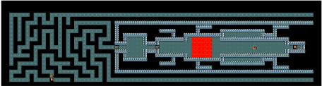

# RL Project
Navigating through the Minihack Quest-Hard dungeon using Deep Reinforcement Learning.

# Environment
### Minihack [[repo link](https://github.com/facebookresearch/minihack)]
In this project, we are using Deep Reinforcement Learing to navigate through the `MiniHack-Quest-Hard-v0` dungeon or environment. Navigating through the quest hard dungeon requires many skils in order to get to the goal location. The following tasks needs to be completed in order to solve this problem:

- Exit the maze
- Crossing the lava river
- Defeating the monster
- Exit the level at the stairs down

Here is the view of the Environment:

# Models
We used the following models:
- Deep Q-Network.
- Advantage Actor Critic.

Deep Q-Network is a function approximation method which learns the Value function while Advantage Actor Critic is a policy gradient method which learns the policy directly instead of the value function. After the experimentation phase, we learned that Advantage Actor Critic performed better than the Deep Q-Network. 

# Running
The models were run in [[google colab](https://colab.research.google.com/)]. In order to run notebooks:
1. Upload the `.py` files in the runtime in google colab after loading the notebooks. For `DQN.ipynb`, you need to upload the following files
    - `model.py`
    - `agent.py`
    - `replay_buffer.py`
2. To run `A2C.ipynb`, you need to upload only `model.py` file.
3. After uploading the files you can run the notebooks.
